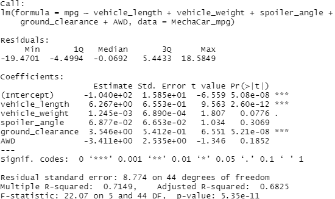

# MechaCar_Statistical_Analysis
## Linear Regression to Predict MPG
1.) According to our results, vehicle length and ground clearance (as well as intercept) are statistically likely to provide non random amounts of variance to the linear regression model. In other words the vehicle length and ground clearance have a significant impact on mpg. Conversely, according to our results, vehicle weight, spoiler angle and AWD are likely to provide random amounts of variance to our model and therefore do not have a significant impact on mpg. There is one possible caveat. When an intercept is statistically significant, it means that the intercept term explains a significant amount of variability in the dependent variable when all independent vairables are equal to zero. Depending on our dataset, a significant intercept could mean that the significant features (such as vehicle length and ground clearance) may need scaling or transforming to help improve the predictive power of the model. Alternatively, it may mean that there are other variables that can help explain the variability of our dependent variable that have not been included in our model. Depending on the dataset and desired performance of the model, you may want to change your independent variables and/or transform them and then re-evaluate your coefficients and significance. 

2.) The slope of the linear model is not considered to be zero. Assuming a significance level of 0.05, a p-value of 5.35e-11 is much much lower than this. This means we can reject the null Hypothesis, which also means that the slope of our linear model is not zero. 

3.) Despite the number of significant variables, this multiple linear regression model does predict mpg of MechaCar prototypes effectively. According to the summary output, the r-squared value of the model is 0.71, meaning there is a strong positive correlation between our variables, and the p-value remained significant, well below the .05 significance level. I still have reservations about having aa statistically significant intercept however.

The results are shown below.

